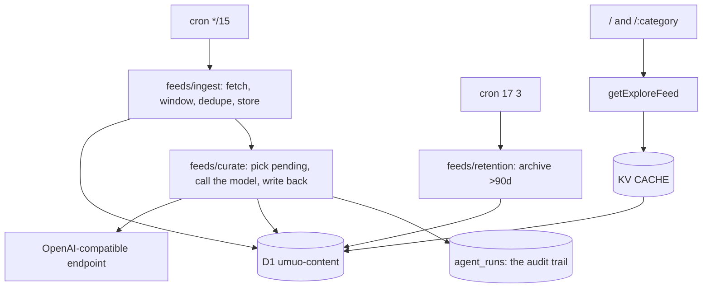

# Repository Guidelines

## Project Overview

**umuo** is an AI-hardware desk. A Cloudflare cron pulls a registry of hardware and AI-industry RSS feeds every 15 minutes into D1, then a model *curates* the new rows — category, tags, summary, blurb, article type, quality score, and an on-beat gate — and an Astro SSR app renders the corpus as a full-bleed masonry board with a category index.

2026 pivots: football → PC hardware → full tech → a Poche-RSS curated explore feed (every external LLM dependency removed) → **this** desk, which brings the model back deliberately, as the classifier rather than as a thin summarizer. The Poche source left the registry in the same change; its corpus stays published as the archive.

## Architecture & Data Flow

`ingestAllSources` reads every source in `FEED_SOURCES`, applies the freshness window and the per-source cap, normalises to `RawArticle`, drops anything whose fingerprint, canonical URL, or normalized title is already stored, and persists the survivors **as they arrived** — no model call on that path, so a model outage cannot stop the desk from collecting.

`curatePending` then drains up to `CURATION_LIMIT` rows whose `enriched_at IS NULL`, in model batches with a per-story fallback, and writes the result back: `ai_summary`/`ai_blurb`/`quality_score`/`article_type`/`category`/`is_on_topic`, the tag rows, and one `agent_runs` line per outcome. A story judged off-beat becomes `status = 'filtered'` — kept for its dedupe guards, excluded from every read. Reads go through `getExploreFeed` / `getExploreFilters`, cached in KV.

## Key Directories

- `src/pages/` — `/` (explore home), `/[category]` (per-category hub), `api/[...route].ts` (delegates to `worker/index.ts`), `rss.xml.ts` + `[category]/rss.xml.ts` (RSS 2.0), `sitemap.xml.ts`, `a/[id].ts` (a 301 to the article's source, kept for the per-link URLs the sitemap used to advertise). There are no per-link *pages*: cards link straight to the source.
- `src/feeds/` — the desk's pipeline, in two halves. Collection: `sources.ts` (the 12-source registry + `INGEST_MAX_AGE_MS`), `ingest.ts` (fetch, window, cap, dedupe, store), `rss.ts` (regex RSS/Atom parse), `enrich.ts` (row storage: `storeArticle`, `applyEnrichment`, `canonicalCategory`, `normalizeTitle`). Curation: `llm.ts` (the OpenAI-compatible client, its validators and its registry-derived prompt), `curate.ts` (the queue, the batching, the retry, and `pendingCurationCount`). Plus `retention.ts` (sweep + `PRUNE_CRON`) and `types.ts`.
- `src/categories.ts` — the category registry in three groups (`CATEGORY_GROUPS`, in rail order: hardware: accelerators/processors/systems/memory/datacenter/peripherals/models; curated: tools/design/development; community: articles/social/media/crypto/other). The `hardware` group is **our own taxonomy** and the only thing `CURATOR_CATEGORY_KEYS` exposes to the prompt; the other two mirror the Poche Explore taxonomy and are kept because pre-pivot rows are still published. See Gotchas.
- `src/data/api.ts` — KV SWR core (`runCached`/`json`) facade + the D1 explore queries and sitemap composer (implementation split across `cache.ts`, `explore.ts`, `sitemapData.ts`). The explore feed's two pure halves sit beside `explore.ts` and are deliberately **not** re-exported by the facade: `exploreArticle.ts` (row → `ExploreArticle` mapping + `EXPLORE_ARTICLE_COLUMNS`) and `exploreCursor.ts` (the keyset codec). `src/data/article.ts` sits outside the facade — it serves the legacy `/a/{id}` redirect and its route imports it directly.
- `src/components/explore/` — `ExploreView` (server-only: grouped category rail with the layout/theme controls at its foot, masonry or list, the append sentinel), `ExploreCard`. `Logo`/`Footer` are shared chrome; the rail is the only sticky chrome on these pages, and it renders twice (desktop column + mobile disclosure) so the controls must be duplicated with it. The client behaviour lives in `src/scripts/board.ts` and the appended pages are rendered by `src/data/exploreCards.tsx` for `/cards.json`.
- `migrations/` — D1 schema (0001–0017). Applied by `bun run deploy`, never automatically. A migration the code depends on (a new column it selects) has to be applied *before* the deploy that reads it.
- `worker/entrypoint.ts` — the deployed handler. `fetch` answers `/media/*` itself and hands everything else to Astro; `scheduled` runs ingest, then curation, then the sweep (told apart by `controller.cron`). `worker/index.ts` is the `/api/*` dispatcher (explore endpoints, then an explicit 404) and is only reachable through `src/pages/api/[...route].ts`.
- `src/media.ts` — rewrites feed-CDN images onto our own origin and serves them at `/media/<storage-id>`. See Gotchas.
- `design-tokens/` — W3C design-tokens JSON; `src/index.css` and `tailwind.config.js` map to it.

## Development Commands

Bun locally, `workerd` in production.

- `bun run dev` — Astro dev server with local Miniflare KV + D1.
- `bun run build` — `astro check && tsc -p tsconfig.worker.json && astro build` (typecheck gates the build).
- `bun run typecheck` / `lint` / `format` — app + worker types, Biome.
- `bunx vitest run` — full suite. `bunx vitest run <file>`, `-t "<name>"` to narrow. `bun run test` = watch mode.
- `bun run deploy` — **migrations then deploy**. Workers Builds must be configured to run this, not bare `wrangler deploy`, or migrations silently never apply.
- `bun run feeds:probe` — fetch every registered source and run the real parser over the bytes: liveness, items that parse, items the window and cap keep, median text length, images, publisher categories. Run it before changing a source, a cap, or the parser.
- `bunx wrangler d1 execute umuo-content --remote --command "…"` — inspect production data.

## Code Conventions & Common Patterns

- **Biome 2.5.1**: 2-space, single quotes, semicolons, trailing commas, 100 cols, arrow parens always. Excludes `*.css`, `dist`, `.astro`, `**/node_modules`, `**/.wrangler`, `bun.lock`, and `worker-configuration.d.ts` (generated by `wrangler types`; regenerate rather than hand-edit).
- **Naming**: PascalCase components and layouts, `*Island.tsx` for hydration wrappers, camelCase hooks and utilities, tests colocated as `<name>.test.ts(x)`.
- **SSR, no client router.** Every view is an independent document. Navigation is `<a href>`; there is no history API. Anything an island renders must be identical on the server and at hydration — dates are formatted UTC-only.
- **KV SWR core** (`runCached`): fresh window → `HIT`, in-flight coalescing via a module-level `Map`, upstream failure serves stored stale data as `STALE` or 502. Emits `x-cache`. D1 queries (explore feed, filters, sitemaps) go through it; **every cursor page** bypasses KV (the cursor is user-controlled and unbounded).
- **Degrade, don't crash**: SSR composers return empty arrays on failure; the explore island swallows `AbortError` and keeps the last good state. Pages never query D1 directly — they go through `src/data/api.ts` getters.
- **Registries are the source of truth.** `src/categories.ts` (three groups; the curator's prompt is generated from the hardware ones), `src/feeds/sources.ts` (the 12 sources, their authority order and their caps), and `src/site.ts` (canonical origin for canonical/og/sitemap). Adding a category is registry-only, and it reaches the model automatically — `parseEnrichment` rejects a category the registry cannot serve, so a prompt that invented a hub would fail the call instead of storing a NULL.
- **The curator is store-first.** Rows are visible the moment they are ingested, with the feed teaser as the deck and the source's authority as the score; the model *replaces* those values. That is what lets ingest keep working without a model key — and it is also the desk's one silent failure mode, so `/api/health` carries `checks.curation.{configured,pending,batch}` and a queue that only grows is visible there. `enriched_at IS NULL AND status = 'published'` **is** the queue.
- **The board's client is one plain module**, `src/scripts/board.ts`, loaded by both board pages: it
  appends a page from `/cards.json` (server-rendered HTML), switches the theme, and wires card media —
  for the server-rendered cards *and* every appended page. Nothing hydrates: `ExploreView` and
  `ExploreCard` are server-only components, and the view toggle is a link rather than state.
- **Copy is English**; Chinese comments explaining non-obvious logic are kept when editing around them.
- **Commits** carry `Co-Authored-By: Claude <noreply@anthropic.com>`.

## Important Files

- `src/categories.ts` — `CATEGORIES: Record<string, Category>` (15 keys in three groups; each carries a `group` the rail renders by) and `CURATOR_CATEGORY_KEYS` (the hardware group alone, which is what the prompt is built from). **The single validation gate** for category values — routes, facet filtering, KV-key safety, storage fallback and the model's own output all check against it. `src/feeds/enrich.test.ts` pins that the Poche labels still resolve; `src/feeds/llm.test.ts` pins that every curated key reaches the prompt.
- `src/site.ts` — `SITE_ORIGIN`, `SITE_NAME`, `SITE_TITLE`, `SITE_DESCRIPTION`, `articleDeck(article)` (one teaser policy: blurb → summary → publisher teaser). Cards render feed images directly and hide broken ones; feed-CDN images are re-originated by `src/media.ts`.
- `src/data/api.ts` — `runCached`, `serveExplore`, `serveExploreRss`, `getExploreFeed`/`getExploreFilters`, sitemap composer. `EXPLORE_ARTICLE_COLUMNS` is the single projection; it and the row coercers live in `exploreArticle.ts`, which together with `exploreCursor.ts` holds the parts of the feed that need no D1 stub to test.
- `src/feeds/ingest.ts` — `ingestAllSources(env, ctx)` and `canonicalizeUrl`; `fingerprintFor`, `readSource` (window + cap), `fetchWithRetry` and `RSS_HEADERS` are module-private. Its report carries `trimmed`, which is the only place a publisher switching to an archive feed becomes visible.
- `src/feeds/sources.ts` — `FEED_SOURCES` (12 sources in authority order, each with a measured `maxItems`) and `INGEST_MAX_AGE_MS`. Deleting an entry is how a source is retired (`enabledSources` intersects the registry, so a D1 row for a departed source is inert) — that is how Poche left.
- `src/feeds/llm.ts` — the curator's client: `enrichWithLLM` / `enrichBatchWithLLM`, `parseEnrichment` (the strict validator), the registry-derived prompt, `MIN_CURATOR_TEXT_CHARS`, and `__promptInternals` for the prompt-coverage test.
- `src/feeds/curate.ts` — `curatePending(env)` (select → batch → apply → log), `CURATION_LIMIT`, `CURATION_BATCH_SIZE`, `MAX_CURATION_ATTEMPTS`, and `pendingCurationCount(env)` for `/api/health`.
- `src/feeds/enrich.ts` — row storage and nothing else: `storeArticle` (the ingest-time insert), `applyEnrichment` (the curator's write-back, including the tag guard), `markCurationSkipped`, `canonicalCategory`, and `normalizeTitle`.
- `src/feeds/retention.ts` — `PRUNE_CRON = '17 3 * * *'`, `ARTICLE_ARCHIVE_DAYS = 90`.
- `src/media.ts` — `proxiedImageUrl` (rewrites a feed-CDN image onto `SITE_ORIGIN`), `mediaRequest`/`serveMedia` (the `/media/<storage-id>` handler), `isVideoMediaUrl` + `withTemporalFragment` (the video thumbnails), and the id allowlist that keeps it from being an open proxy.
- `worker/entrypoint.ts` / `worker/index.ts` — see Key Directories.
- `wrangler.toml` — all Cloudflare bindings/crons/vars (see Infrastructure).
- `env.d.ts` / `worker/env.d.ts` — hand-declared `Cloudflare.Env` for the two tsconfigs; must match the bindings **and vars** in `wrangler.toml`. The `[vars]` must be restated with the *literal* types `wrangler types` emits — a hand-written `string` conflicts with the generated chain and the error surfaces at `handle(request, env, ctx)` in `worker/entrypoint.ts`, nowhere near the declaration. `src/bindings.test.ts` pins bindings, var literals and the optional secret against `wrangler.toml`. `ASSETS` is listed in the worker half only, and it is load-bearing there: drop it and `handle(request, env, ctx)` stops typechecking, because that program excludes the root `env.d.ts` whose `Env` the data layer exports. Nothing in `src/` reads `ASSETS`, so the app half omits it.

## Runtime/Tooling Preferences

- **Bun is the only supported package manager** (`bun.lock` committed, npm/yarn/pnpm locks gitignored). Run tests via `bunx vitest`, never `bun test` (Bun's built-in runner ignores `vitest.config.ts`).
- **Config file is `wrangler.toml`** — not `wrangler.jsonc`.
- `worker-configuration.d.ts` is generated by `wrangler types` — regenerate after changing bindings/vars, never hand-edit. Biome excludes it.
- **No Durable Objects, deliberately.** Workers Builds runs `wrangler versions upload` for PR previews, which cannot apply a DO migration — adding one breaks every PR build.
- **No CI in the repo.** Deployment is Cloudflare Workers Builds from `main`, which must run `bun run deploy` (migrations-then-deploy) or migrations never apply.

## Infrastructure

|||
|---|---|
|Worker|`umuo`, deployed by Workers Builds from `main`|
|KV|`CACHE` `b5d6927ae…`|
|D1|`DB` → `umuo-content`, primary region **APAC** (cannot be moved without recreating)|
|Crons|`*/15 * * * *` ingest + curation, `17 3 * * *` retention sweep|
|LLM|`LLM_BASE_URL` / `LLM_MODEL` (`mimo-v2.6-flash`, a reasoning model: 56–130s and ~2K reasoning tokens per batch of 8) are `[vars]`; `LLM_API_KEY` is a secret (`wrangler secret put`) and optional — without it the desk ingests and serves, and the queue grows|

## Testing & QA

Vitest 4, `jsdom`, `globals: true`, `fileParallelism: false` (tests mutate global fetch and location). `src/test-setup.ts` imports jest-dom and `afterEach(vi.restoreAllMocks())`. Files needing node/workerd semantics carry `// @vitest-environment node` as the first directive, including `worker/index.test.ts` (where the workers-types reference precedes it).

Patterns:
- `react-dom/server` `renderToString` asserts SSR/hydration safety for the explore island (`ssr.test.tsx`).
- Fetch mocking via `vi.stubGlobal('fetch', fetchMock)` (must `vi.unstubAllGlobals()` yourself) or module-scope `globalThis.fetch = …` (`worker/index.test.ts`).
- Routes/worker tested by calling `worker.fetch(new Request('https://x/api/explore'), env, mockCtx())` directly — there is no Astro middleware/`onRequest`.
- KV/D1 mocked as `vi.fn()` spy objects cast `as unknown as Env` / `as unknown as Env['DB']`; SQL-capture mocks assert on `capturedSql`/`capturedBindings`.
- Module mocking via `vi.hoisted` + `vi.mock` before importing the module under test when a test needs to replace an import.
- **Binding tests** pin duplicated constants to their on-disk copy: `retention.cron.test.ts` (wrangler.toml `crons` ↔ `PRUNE_CRON`), `bindings.test.ts` (wrangler.toml bindings/vars/secrets ↔ both `env.d.ts` files), `index.css.test.ts` (design-tokens ↔ `index.css`). File-reading tests use `resolve(process.cwd(), …)` — jsdom mangles `import.meta.url`.
- **The curator's policy is tested against captured SQL, not against its own report**: `curate.test.ts` builds a fake D1 that records `bind()`ed statements, so "the UPDATE carries status='filtered'" is asserted on what D1 received. `llm.test.ts` stubs `fetch` and asserts the prompt, the retries and the validator rejections. Its call double must answer a *batch* prompt with `{results:[…]}` and a single-story prompt with the bare object, or a legitimate batch looks rejected.
- **End-to-end without spending model credit**: run the committed stub ([`scripts/fake-llm.ts`](../scripts/fake-llm.ts), which reads the real prompt and answers in both shapes the client sends), point the worker at it, and drive the schedule directly —
  `bun scripts/fake-llm.ts 8899 &`
  `bunx wrangler dev --config dist/server/wrangler.json --port 8787 --local --test-scheduled --var LLM_BASE_URL:http://127.0.0.1:8899/v1 --var LLM_MODEL:fake --var LLM_API_KEY:test-key`
  `curl "http://127.0.0.1:8787/cdn-cgi/handler/scheduled?cron=*/15+*+*+*+*"`
  Then read `/api/health` (`checks.curation.pending` should fall) and query the local D1 for `agent_runs` and `article_tags`. A rebuild regenerates `dist/server/wrangler.json` and therefore lands on a **fresh, empty** local D1 — re-apply migrations first (`scripts/README.md`).

**A passing suite is not evidence code runs.** Modules have kept green suites long after nothing imported them. When you delete a module, delete its tests, then walk imports from every route and `worker/entrypoint.ts` to see what else is orphaned. (Done for the football removal: `newsFeed.ts`, its JSON contract, the `obj/arr/str/slugify` ESPN coercers and the BBC image rewriter all went together.)

## Gotchas

Each of these cost real debugging. They are not hypothetical.

- **A feed can ship its entire archive.** Measured when the desk was built: `openai.com/news` returned **1247** items and `huggingface.co/blog` 874, of which 11 and 6 were inside a week. Two guards, in this order: `INGEST_MAX_AGE_MS` (7 days) and then the source's `maxItems` cap, both in `readSource`. Capping before the window would just slice the archive. The first real tick parsed 1672 items and kept 179 — if that ratio ever inverts, the caps are gone. `report.trimmed` is where this shows up.
- **A source is a measurement, not a guess.** Every entry in `FEED_SOURCES` was probed with the real parser first (that is what `bun run feeds:probe` is for, and it reads the live registry). Four candidates were rejected for measured reasons: 403 to our user agent (`videocardz`, `hpcwire`), a 15s timeout (`blog.google/…/ai/rss`), RSS 1.0/RDF that this regex parser reads as zero items (`export.arxiv.org/rss/cs.AR`), and feeds whose items carry **no text at all** (`huggingface.co/blog`, `nextplatform.com`) — the curator would be judging `(none)`. Sources with nothing published in a week (`hexus`, `tftcentral`) are zombie feeds.
- **Publisher categories are now only a hint, and usually an ignored one.** Each outlet publishes its own vocabulary ('gpus', 'ai/ml/dl', 'nanosheets'…), so `storeArticle` stores `canonicalCategory(publisher)` — usually `NULL` — and the curator replaces it from the story text. That is why `unmappedCategories` is logged at **info** with a truncated list (measured 179/179 rows and 60+ values on the first tick); it is a signal that a feed changed shape, not a hole in the board. The old rule — the registry must mirror upstream exactly, or stories never reach a hub — died with the Poche source.
- **The curator is the topic gate now.** `storeArticle` sets `is_on_topic = 1` and publishes; `applyEnrichment` is what can set `status = 'filtered'` for an off-beat story (measured: a Ninja Theory layoff story and a Sony/Xbox story from KitGuru/The Verge were rejected on the first real ticks). Until a row is curated it *is* on the board — that is the store-first trade, and `checks.curation.pending` in `/api/health` is how you see it.
- **The archive is not the curator's backlog.** Migration 0016 stamps every pre-existing row with `enriched_at = updated_at`. Without it, the first curation tick would start judging the whole Poche corpus with the new hardware prompt, and the stories it rejected would be set to `filtered` — silently emptying the site's existing content from every read path. Only rows stored after the pivot carry `enriched_at IS NULL`.
- **`agent_runs` was dropped in 0005 and came back in 0017.** 0005 was right at the time: the table was written on every insert and never SELECTed. The curator makes it load-bearing — `MAX_CURATION_ATTEMPTS` is enforced by counting that table's `failed` rows per fingerprint, so without it a story the model can never judge would spend a model call every 15 minutes forever. One row per outcome (`stored`/`filtered`/`skipped`/`failed`), and `article_fingerprint` **is** `articles.id` because `storeArticle` uses the fingerprint as the primary key.
- **The curator's timeout and batch size are calibrated to one model, and swapping the model silently breaks them.** The failure mode is quiet and terminal: the first model here answered a batch of 8 in ~27s, so the client's ceiling was 60s. `mimo-v2.6-flash` measures 25s for a *single* story and 56–130s for the batch, so every call timed out — and a timeout is counted as a failed attempt, so each story would have burned `MAX_CURATION_ATTEMPTS` and left the queue permanently uncurated. Two consequences: `LLM_MODEL` is not a free-floating var (change it, then re-measure before trusting a tick), and `max_tokens` is sent explicitly because this model spends ~2K tokens thinking before it answers — a provider default can truncate the JSON, which the validator can only read as an unparseable reply.
- **`[vars]` are typed as literals, and that is a landmine.** `wrangler types` emits `LLM_BASE_URL: "https://api.b.ai/v1"`, so the hand-written declarations in `env.d.ts`/`worker/env.d.ts` must repeat the literal — a `string` there conflicts with the generated chain and the failure appears at `handle(request, env, ctx)` with no mention of the var. `bindings.test.ts` pins the three files together, including that `LLM_API_KEY` stays out of `wrangler.toml` and optional in both halves.
- **Explore cursors are keyset, not offsets** — `<day_bucket>:<quality_score>:<published_at>:<id>`, where the day bucket is `floor(published_at/86400000)` and immutable, so the keyset is stable under inserts. Type guards on `ExploreFeed.nextCursor` must say `string`; when one said `number`, every SSR page silently reported the feed exhausted.
- **`PRUNE_CRON` is duplicated in `wrangler.toml`** because a Worker cannot read that file. `retention.cron.test.ts` holds them together. Anything that is not `PRUNE_CRON` is treated as an ingest tick, so a stray third schedule means an extra full fan-out.
- **Never DELETE from `articles`.** Retention archives instead: dropping a row takes its `canonical_url` and `fingerprint` with it, and the next tick would re-ingest the same story. Migrations 0009 (football) and 0010 (pre-Poche tech) soft-offline retired corpora while preserving those dedupe guards. Migration 0011 only clears stale `title_norm` values (see below) — it retires no corpus.
- **`article_tags` holds topic tags, never a copy of the category.** The curator writes them now (up to 8, from a controlled vocabulary plus proper nouns) — `storeArticle` still writes none, so a story that has never been curated has no tags. The guard against the 0012 defect is two-sided and both halves matter: the prompt says "Never repeat the category as a tag", and `applyEnrichment` lowercases, dedupes and drops any tag equal to the assigned category before writing, because a prompt is not an invariant. Tags are *replaced* on each write, not appended. The RSS `categoriesFor` reads them as an optional extra and degrades correctly to none — verified on a real feed: `category:memory` alongside `tag:dram`/`tag:pricing`, never `tag:memory`.
- **Dedupe before storage.** `ingestAllSources` filters stored fingerprints, canonical URLs, and Unicode-aware normalized titles before `storeArticle`. All three matter: a rewritten headline on a stored URL looks like a new fingerprint, while a title-only duplicate can arrive from another source. Migration 0011 cleared legacy `title_norm` values that an ASCII-only normalizer wrote, so pre-pivot rows have `NULL` and rely on the fingerprint and canonical-URL guards only; new rows always carry the current normalizer's key.
- **`sources.enabled` is an operator override, not a registry mirror.** `ensureSources` upserts kind/name/url/authority but deliberately never rewrites `enabled`; `enabledSources` intersects D1-enabled ids with `FEED_SOURCES`, so rows for sources that left the registry are inert. Do not bulk-flip `enabled` in a migration.
- **Explore cache keys embed the query.** Deep pages bypass KV entirely: a cursor is user-controlled and unbounded, so caching it let anyone write KV keys without limit. It is re-serialised from its parsed form only so a malformed one collapses to page one — the request bypasses KV anyway, and the id it carries is verbatim, so the key space would be unbounded. Free-text `q` was removed with the header's search box; `exploreQueryFromUrl` no longer reads it.
- **`description` is fingerprint-stable.** The feed teaser is stored capped at 4000 characters, while only its first 240 characters (plus the URL host and path) feed the fingerprint; keep that behavior stable unless you intend to re-ingest the corpus.
- **The stored `freshness_score` column is dead; the computed one is exported but not rendered.** `LIVE_FRESHNESS` computes a 0–100 value at query time from `published_at` over a 72h window, and `/api/explore` carries it as `freshnessScore` for consumers; the stored column defaults to 0, is never written, and is ignored. No UI renders either — the card's meter is `qualityScore` — so treat the field as API surface, not display state. `article_type` was that same shape of leftover — the pipeline wrote `'link'` for every row and the card rendered the constant — and the curator now writes a real value (`news`/`review`/`deal`/`leak`/`analysis`/`guide`/`video`). Nothing renders it yet: it is stored and available, not display state.
- **Cron runs are deployment-driven, but a tick can be driven locally.** `wrangler dev` does not fire the production schedule; run it with `--test-scheduled` and drive the handler directly: `curl "http://127.0.0.1:8787/cdn-cgi/handler/scheduled?cron=*/15+*+*+*+*"` (`/__scheduled` is the older path and 404s on wrangler 4.147). In production, trigger by hand with a one-shot cron, deploy, let it fire, then remove it. Note the local D1 is named from `dist/server/wrangler.json`, so **a rebuild lands on an empty database** — see `scripts/README.md`.
- **`/media/<id>` is not an open proxy.** It re-serves feed-CDN images so that origin never appears in card markup, the island payload, or `og:image`. The route takes a storage id and never a URL: `src/media.ts` checks a UUID pattern before building the upstream URL, so the `/api/img?src=<any-url>` proxy the football desk removed is *not* what this is — `worker/index.test.ts` keeps a guard that URL-shaped input still 404s. An unrecognised path on the upstream origin is dropped rather than forwarded, since forwarding it would leak the host the module exists to hide. Do not add a `?src=` form: that is the SSRF hole. Reads are edge-cached for a day (`cacheEverything`), the stored `articles.image_url` keeps the upstream value, and the rewrite happens at read time in `exploreArticle`. **The route lives in `worker/entrypoint.ts`, not `worker/index.ts`** — Astro mounts that dispatcher at `/api/*` only, so a `/media/` handler placed there is unreachable and every proxied image 404s against `ASSETS`; `worker/entrypoint.test.ts` guards that wiring by asserting a storage-id request is answered without consulting Astro. **It must also claim only storage ids and hand everything else back.** `/media/` is the path of the `media` category hub as well as the proxy prefix, so claiming the whole prefix swallowed `/media/rss.xml` — that hub's own feed — and answered 404 for a URL `/sitemap.xml` advertises. `mediaRequest` returns null for any non-id, and that same test file asserts such a path does reach Astro's handler.
