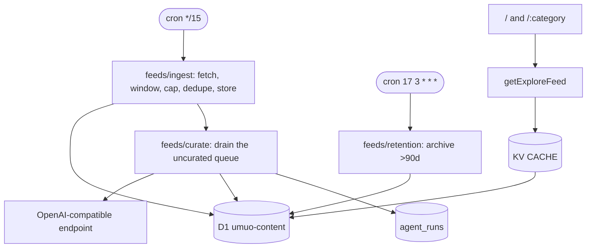

# umuo

> AI-hardware desk on Cloudflare Workers. A cron pulls a registry of hardware and AI-industry RSS feeds into D1, a model curates every new story (category, tags, summary, blurb, quality score, on-beat gate), and Astro renders the result as a fast masonry board with category hubs and RSS feeds.

[](https://deploy.workers.cloudflare.com/?url=https://github.com/youming-ai/ai)
[](https://bun.sh) [](https://astro.build) [](./LICENSE)

*No ads, no tracking, no reader-side JS framework. The source registry in `src/feeds/sources.ts`, the taxonomy in `src/categories.ts` and the classifier prompt in `src/feeds/llm.ts` are yours to replace — the first two feed the third automatically.*

---

## Features

- **15-min cron ingest** — fetches every registered feed, applies a 7-day freshness window and a per-source cap (one publisher ships 1247 items), de-duplicates by fingerprint + canonical URL + normalized title, and stores the survivors straight into D1
- **Model curation** — an OpenAI-compatible endpoint assigns category, tags, summary, blurb, article type and a 0–100 quality score, and rejects off-beat stories; batch calls with a per-story fallback, a per-tick budget and a retry cap
- **Store-first, so a model outage is not a content outage** — rows serve the moment they are ingested and are upgraded when curated; `/api/health` reports whether the curator is configured and how deep its queue is
- **KV SWR cache** — `runCached` with stale-while-revalidate, request coalescing, bounded keys (cursor pages bypass KV)
- **Masonry board** — native CSS multi-column, infinite scroll, per-category `/[category]` hubs
- **SEO ready** — `/rss.xml`, `/[category]/rss.xml`, `/sitemap.xml`, canonical/og tags, JSON-LD
- **Ops** — `/api/health` reports the deployed version, probes D1 and the cache binding (answering `503` when either is unreachable) and carries the curator's queue depth
- **Auditable** — one `agent_runs` row per curated story says what the model did with it, and `bun run feeds:probe` checks every source against the real parser before you trust it

## Tech stack

Astro 7 + React islands · Cloudflare Workers (workerd) · D1 + KV · Tailwind · Vitest · Biome · Bun

## Prerequisites

- **Bun ≥ 1.4.2** (`packageManager: bun@1.4.2`)
- Cloudflare account + `bunx wrangler login` for deployment
- An OpenAI-compatible endpoint and key for curation. Optional: without `LLM_API_KEY` the desk still ingests and serves — it just reports itself uncurated and the queue grows

## Quick start

```bash
git clone https://github.com/youming-ai/ai my-desk && cd my-desk
bun install

# One-time Cloudflare setup:
bunx wrangler kv namespace create CACHE
bunx wrangler d1 create umuo-content
# → paste the returned ids into wrangler.toml

# The curator's key (LLM_BASE_URL / LLM_MODEL live in wrangler.toml [vars]):
bunx wrangler secret put LLM_API_KEY
# …or for local dev only, put LLM_API_KEY=… in .dev.vars (gitignored)

bun run dev        # http://localhost:4321 (Miniflare KV + D1)
bun run feeds:probe  # check the registered sources against the real parser
```

| Command | What it does |
|---------|--------------|
| `bun run dev` | Astro dev with local Miniflare |
| `bunx vitest run` | All tests (watch: `bun run test`) |
| `bun run typecheck` | `astro check` + `tsc -p tsconfig.worker.json` |
| `bun run lint` / `format` | Biome |
| `bun run deploy` | **Migrations then deploy** — always use this, not bare `wrangler deploy` |

## Configuration

All knobs are code, not env spaghetti. Edit one file per concern:

| Concern | File | Notes |
|---------|------|-------|
| Branding / origin | `src/site.ts` | `SITE_ORIGIN`, `SITE_NAME`, `SITE_TITLE`, `SITE_DESCRIPTION` |
| Icons / social card | `public/favicon.svg`, `public/og.svg` | Edit the SVG, then rasterize `og.svg` to `og.png` (the default `og:image`) |
| Taxonomy | `src/categories.ts` | `CATEGORIES` — keys become `/:category` routes. The `hardware` group is also what the classifier prompt is built from |
| Sources | `src/feeds/sources.ts` | The 12 feeds, in authority order (which is also the cross-source dedupe precedence), each with a per-tick `maxItems` cap; `INGEST_MAX_AGE_MS` is the freshness window |
| Curator | `src/feeds/llm.ts`, `src/feeds/curate.ts` | The prompt and the validators, `CURATION_LIMIT` (per tick), `CURATION_BATCH_SIZE`, `MAX_CURATION_ATTEMPTS` |
| Endpoint | `wrangler.toml` `[vars]` | `LLM_BASE_URL`, `LLM_MODEL`; the key is a secret |
| Retention | `src/feeds/retention.ts` | `ARTICLE_ARCHIVE_DAYS` (default 90) |
| Analytics | `src/layouts/Layout.astro` | `TODO(template)` hook — add yours there, nothing ships by default |

One secret: `LLM_API_KEY`. Without it nothing breaks — ingest, the board, the hubs and the feeds all work, the curator reports itself unconfigured, and `/api/health` shows the queue growing.

## Architecture



- **Ingest** — fetches every source, keeps what is inside the window and under the cap, de-duplicates, stores. No model call on this path.
- **Curate** — drains up to `CURATION_LIMIT` rows where `enriched_at IS NULL`, in batches of 8 (falling back to one call per story), and writes category, tags, summary, blurb, type, score and the on-beat verdict back. A story that fails 3 times stops being selected.
- **Reads** — `getExploreFeed` via `runCached`; cursor pages bypass KV (unbounded key space).
- **Retention** — archive, never `DELETE` (keeps `fingerprint`/`canonical_url` guards).

## Product surface

| Route | Description |
|-------|-------------|
| `/` | Global board + rail |
| `/:category` | Per-category hub (e.g. `/design`) |
| `/rss.xml`, `/:category/rss.xml` | RSS 2.0 |
| `/sitemap.xml` | Sitemap — category hubs and feeds |
| `/media/<uuid>` | Feed-CDN images, re-served under this origin. Unrecognised but validly encoded `/media/…` paths fall through to the app; malformed percent-encoding is answered `400` |
| `/a/:id` | Legacy per-link URL, 301s to the article's source |
| `/api/explore` | JSON feed for the board's infinite scroll. `category`, `cursor`, `limit`; cursor pages bypass KV |
| `/api/explore/filters` | The rail's counts. Global — `?category` is ignored |
| `/api/health` | Liveness, deployed version, D1/cache reachability (`503` when degraded), and `checks.curation` — whether the curator is configured, how many stories are waiting, and the per-tick batch |

## Deployment

Workers Builds expects **`bun run deploy`** as the build command (not `wrangler deploy` / `versions upload` alone) — otherwise D1 migrations never apply. Preview deploys run `versions upload` and must not touch D1.

Free-tier notes: ingest writes directly to D1; no Durable Objects on purpose — they break `versions upload` previews. Migrations 0016 and 0017 must be applied before the deploy that reads them (`bun run deploy` does this in order); 0016 also stamps the pre-existing corpus as already settled so the curator does not start re-judging the archive.

## Cost (approx, Cloudflare free tier)

KV + D1 + Workers free tier covers the desk. The only metered cost is curation: ~180 stories arrived in one tick when this shipped, and 8 are curated per tick in a single batch of 8 carrying ~3KB of instructions. The configured model (`mimo-v2.6-flash`) is a **reasoning** model — a batch measured 56–130s and ~2.6K completion tokens, of which ~2K are its own thinking — so a day of typical volume is a few cents and `CURATION_LIMIT` is the dial.

## Troubleshooting

- **Empty board locally** — no ingest has run. Local `wrangler dev` does not run the production cron; start it with `--test-scheduled` and drive one tick: `curl "http://127.0.0.1:8787/cdn-cgi/handler/scheduled?cron=*/15+*+*+*+*"`. In production, deploy a one-shot cron, let it fire, then remove it.
- **Cards show the publisher's teaser and the score never moves** — the curator is not running: check `checks.curation` in `/api/health` (`configured: false` means no `LLM_API_KEY`; a large `pending` means the endpoint is failing — `/api/health` will not page you for either).
- **Feed fetch failure** — `bun run feeds:probe` re-checks every source with the real parser; source failures are non-fatal and existing content stays available.
- **A source floods the desk** — a publisher that starts shipping its whole archive is absorbed by `INGEST_MAX_AGE_MS` and `maxItems`; the scheduled log line `trimmed N/M parsed items` is where you see it.
- **Stale KV** — `runCached` serves `STALE` on upstream failure; check `x-cache` header (`HIT`/`MISS`/`REVALIDATED`/`STALE`).

## Contributing

See [AGENTS.md](./AGENTS.md) for architecture, conventions, and gotchas. PRs welcome.

## License

MIT — see [LICENSE](./LICENSE).